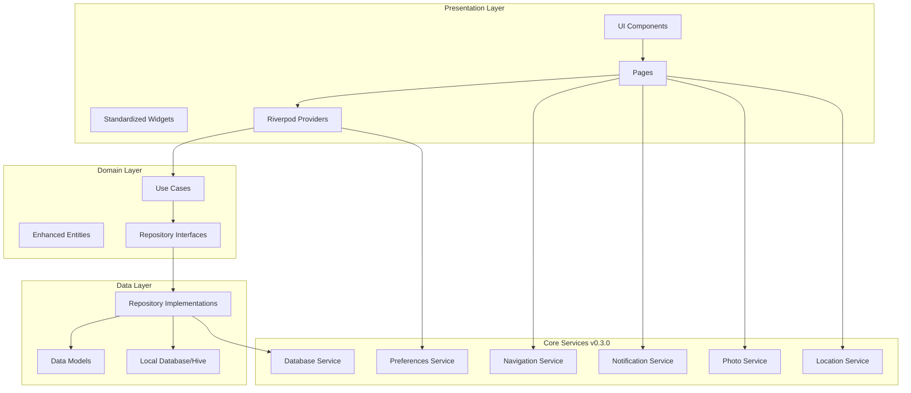
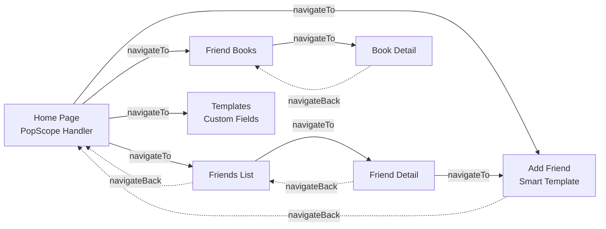
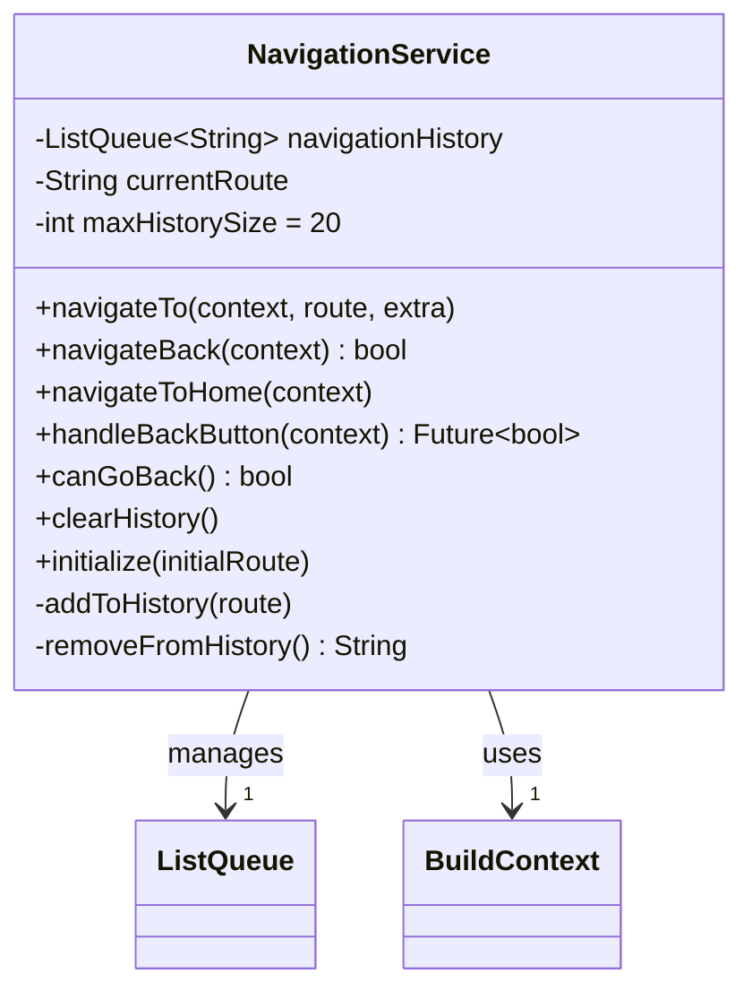
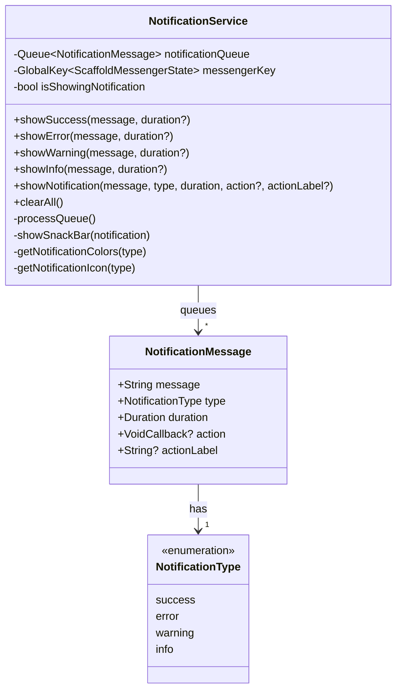
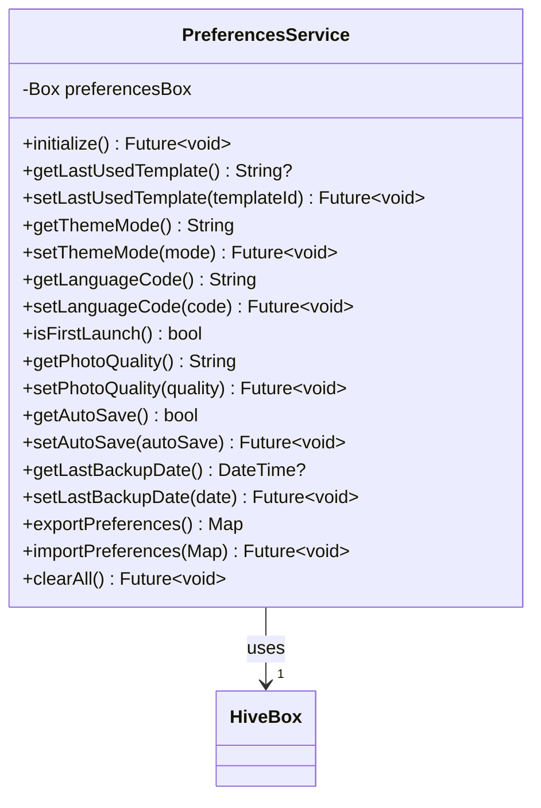
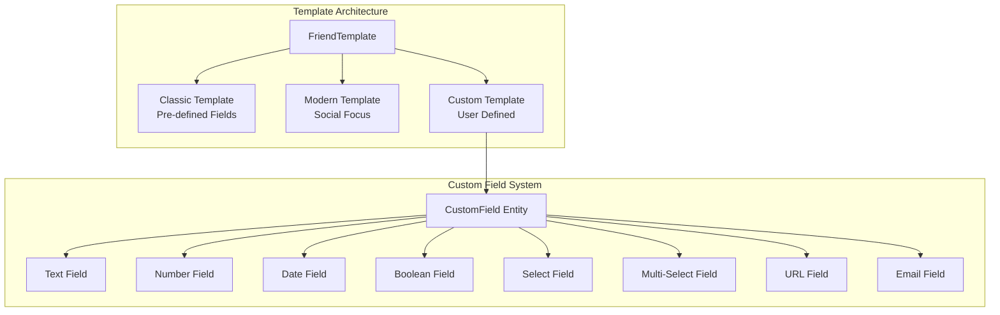
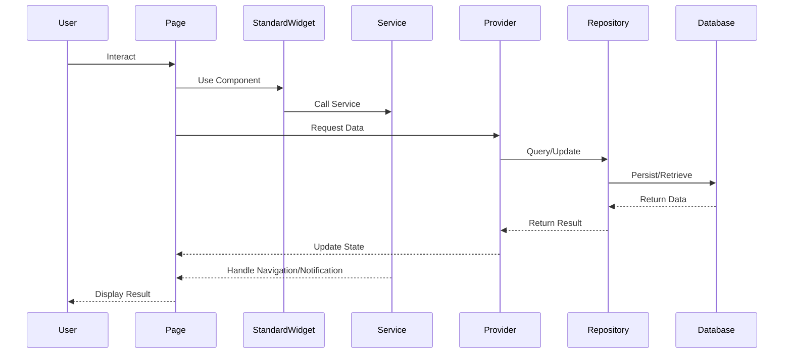
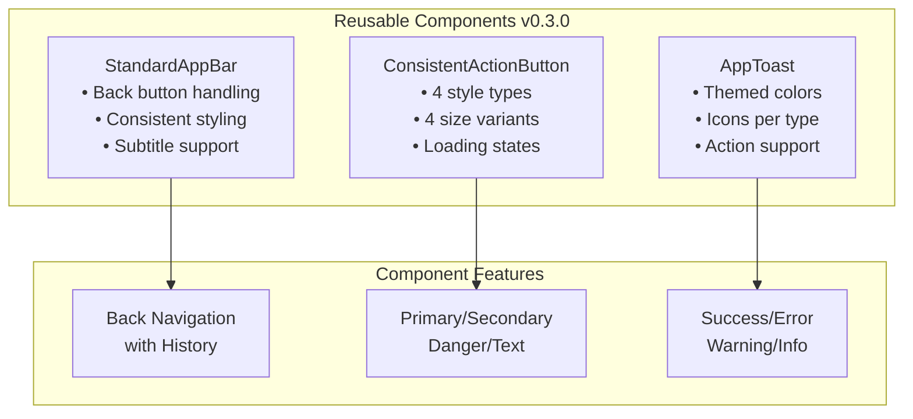
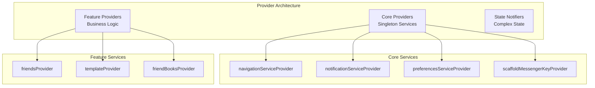
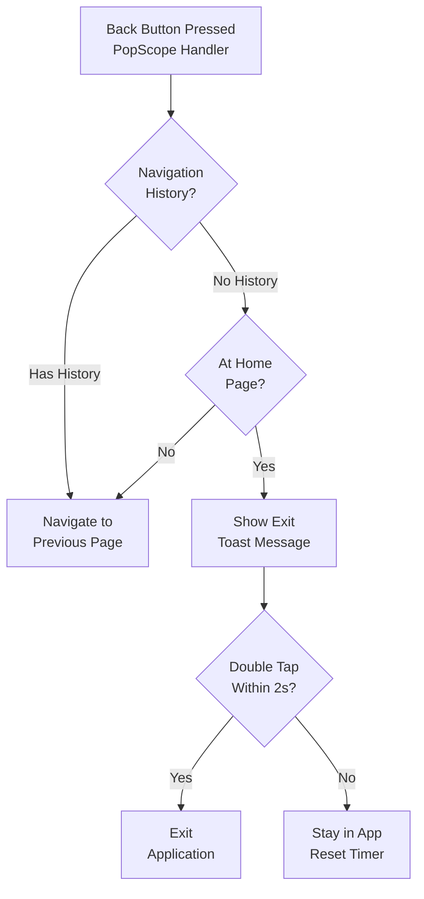

# Architecture Overview - MyFriends App

## Version 0.3.0 - Refactored Architecture

This document provides a comprehensive overview of the MyFriends app architecture after the v0.3.0 refactoring.

## 🏗️ Core Architecture



## 📱 Navigation Flow with History Management



## 🔧 Service Architecture

### 1. Navigation Service



**Key Features:**
- ✅ Navigation history stack (max 20 entries)
- ✅ Android back button handling
- ✅ Consistent navigation methods
- ✅ Deep linking support
- ✅ Route restoration

### 2. Notification Service



**Key Features:**
- ✅ Centralized notification management
- ✅ Queue system for multiple notifications
- ✅ Consistent positioning below app bar
- ✅ Different types with colors/icons
- ✅ Support for action buttons

### 3. Preferences Service



## 📋 Enhanced Template System



## 🔄 Data Flow with Centralized Services



## 🎨 Standardized UI Components



## 🔀 State Management



## 🔙 Android Back Button Handling



## 📁 Project Structure v0.3.0

```
lib/
├── main.dart                          # Enhanced entry point
├── core/                              # Core functionality
│   ├── navigation/                    # Navigation setup
│   │   └── app_router.dart
│   ├── services/                      # Centralized services (NEW)
│   │   ├── navigation_service.dart    # Navigation with history
│   │   ├── notification_service.dart  # Unified notifications
│   │   ├── preferences_service.dart   # User preferences
│   │   ├── database_service.dart
│   │   ├── location_service.dart
│   │   └── photo_service.dart
│   ├── providers/                     # Core providers (NEW)
│   │   └── core_providers.dart        # Service injection
│   ├── widgets/                       # Standardized widgets (NEW)
│   │   ├── standard_app_bar.dart      # Consistent app bar
│   │   ├── consistent_action_button.dart # Unified buttons
│   │   └── app_toast.dart            # Toast notifications
│   └── theme/                         # Theme configuration
│       ├── app_theme.dart
│       ├── app_colors.dart
│       └── app_typography.dart
├── features/                          # Feature modules
│   ├── friend/                        # Friend management
│   │   ├── domain/
│   │   │   ├── entities/
│   │   │   │   ├── friend.dart
│   │   │   │   └── friend_template.dart # Enhanced with custom fields
│   │   │   └── repositories/
│   │   ├── data/
│   │   │   ├── models/
│   │   │   └── repositories/
│   │   └── presentation/
│   │       ├── pages/
│   │       │   ├── add_friend_page.dart # Smart template selection
│   │       │   ├── friend_detail_page.dart
│   │       │   └── friends_list_page.dart
│   │       ├── widgets/
│   │       └── providers/
│   ├── home/                          # Home with PopScope
│   │   └── presentation/
│   │       └── pages/
│   │           └── home_page.dart     # Android back handling
│   ├── friendbook/                    # Friend book feature
│   └── template/                      # Template management
│       └── presentation/
│           └── pages/
│               └── template_management_page.dart # Custom fields UI
└── l10n/                              # Localization (DE/EN)
```

## 🚀 Key Improvements in v0.3.0

### Core Services
1. **Navigation Service**: Centralized navigation with history stack
2. **Notification Service**: Unified toast/snackbar system
3. **Preferences Service**: Persistent user settings

### UI/UX Enhancements
1. **Android Back Button**: Proper handling with navigation queue
2. **Consistent Components**: Standardized app bars and buttons
3. **Smart Features**: Last used template auto-selection
4. **Custom Fields**: 8 field types for template customization

### Code Quality
1. **Dependency Injection**: Runtime injection via Riverpod
2. **Separation of Concerns**: Clear service boundaries
3. **Error Handling**: Centralized through notification service
4. **Code Reusability**: Shared components and services

## 💻 Development Guidelines

### Adding New Features

```dart
// 1. Create feature structure
lib/features/new_feature/
├── domain/
├── data/
└── presentation/

// 2. Use centralized services
final navigationService = ref.read(navigationServiceProvider);
final notificationService = ref.read(notificationServiceProvider);
final preferencesService = ref.read(preferencesServiceProvider);

// 3. Use standardized components
StandardAppBar(title: 'Page Title')
ConsistentActionButton(label: 'Action', style: ActionButtonStyle.primary)
```

### Service Usage Examples

```dart
// Navigation with history
navigationService.navigateTo(context, '/route');
navigationService.navigateBack(context);

// Notifications
notificationService.showSuccess('Operation successful');
notificationService.showError('An error occurred');

// Preferences
await preferencesService.setLastUsedTemplate('modern');
final template = preferencesService.getLastUsedTemplate();
```

## 🔒 Security Considerations

- ✅ Local data encryption via platform-specific secure storage
- ✅ No sensitive data in plain preferences
- ✅ Secure photo path resolution
- ✅ Proper permission handling for camera/location

## ⚡ Performance Optimizations

- ✅ Lazy service initialization
- ✅ Navigation history pruning (20 entries max)
- ✅ Notification queue management
- ✅ Efficient state management with Riverpod
- ✅ Widget reusability for reduced rebuilds

## 🔮 Future Enhancements

- [ ] Cloud synchronization service
- [ ] Advanced search with filters
- [ ] Export/Import functionality
- [ ] Additional languages
- [ ] Theme customization UI
- [ ] Offline-first architecture
- [ ] Analytics integration
- [ ] Social sharing features